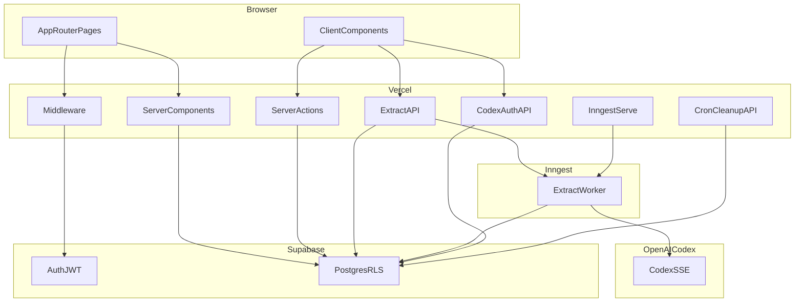

# Lock-In — AI Job Application Tracker

Track job applications in a focused dashboard. Paste a job description and AI extracts structured fields using **your ChatGPT subscription** — the app owner pays zero API costs.

Built as a full-stack portfolio project demonstrating production-minded patterns: fail-closed configuration, row-level security, keyset pagination, atomic rate limiting, and honest capacity planning.

---

## Features

- **Authentication** — Email magic link and Google OAuth via Supabase Auth
- **Application CRUD** — Create, view, edit, and delete job applications with status tracking
- **AI extraction** — Paste a job description; Codex OAuth extracts company, title, skills, salary, deadlines, and more
- **Follow-up suggestions** — Auto-suggests a follow-up date 14 calendar days after applying
- **Dashboard** — Paginated table with search, filters, inline status updates, and keyboard shortcuts (`/` search, `n` new)
- **Admin panel** — User overview for the configured admin email
- **Dark mode** — Light / dark / system theme toggle
- **Legal pages** — Privacy policy and terms of service

Manual entry always works without ChatGPT connected.

---

## Tech stack

| Layer | Choice | Why |
|-------|--------|-----|
| Framework | **Next.js 16** (App Router) + React 19 + TypeScript | Server Components, Server Actions, and Route Handlers in one deployable unit |
| Styling | **Tailwind CSS 4** + **shadcn/ui** | Utility-first CSS with accessible, composable components |
| Database & auth | **Supabase** (Postgres + Auth + RLS) | Managed Postgres with built-in auth and row-level security — no custom auth server |
| AI extraction | **Codex device-code OAuth** + **Inngest** jobs | Users bring their own ChatGPT subscription; long Codex calls run in background workers |
| Validation | **Zod v4** | Runtime validation for env vars and AI extraction output |
| Deployment | **Vercel** | Serverless functions, cron jobs, and edge middleware |
| Background jobs | **Inngest** | Decouples 10–30s Codex calls from HTTP request lifecycle |
| CI | **GitHub Actions** | Lint, typecheck, and build on every push |

---

## Architecture



See [docs/ARCHITECTURE.md](docs/ARCHITECTURE.md) for component-level detail.

Route labels: `POST /api/extract` (enqueue), `GET /api/extract/[jobId]` (poll), `/api/inngest`, `/api/codex/auth/*`, `GET /api/cron/cleanup-extraction-usage`.

---

## Data flow: AI extraction

1. User signs in via Supabase Auth (magic link or Google OAuth).
2. User connects ChatGPT in **Settings** via Codex device-code OAuth; tokens are stored in Postgres (`codex_connections`) with RLS.
3. On **New Application**, user pastes a job description and clicks **Extract fields**.
4. Client sends `POST /api/extract` with the raw description.
5. Server validates auth, checks Codex is connected, applies burst rate limit (20/min via Postgres RPC + advisory lock), inserts an `extraction_jobs` row (`pending`), enqueues an Inngest event, and returns **`202 { jobId }`**.
6. An Inngest worker refreshes Codex tokens, calls the OpenAI Codex SSE API, parses the response with Zod, and updates the job to `completed` or `failed`.
7. Client polls `GET /api/extract/[jobId]` every ~2s until the job is terminal; extracted fields pre-fill the form.
8. User reviews and saves via a Server Action; Supabase RLS ensures `auth.uid() = user_id`.

A Vercel Cron job deletes `extraction_usage` and `extraction_jobs` rows older than 24 hours nightly.

---

## Key decisions and trade-offs

| Decision | Trade-off |
|----------|-----------|
| **BYOK ChatGPT via Codex OAuth** | Zero app-owner API cost, but relies on an unofficial OAuth flow that may break if OpenAI changes access |
| **Supabase RLS over custom auth** | Faster to ship and audit; database is the authorization boundary |
| **Async extraction via Inngest + job poll** | HTTP handlers return in milliseconds; needs Inngest (or Dev Server locally) and a short poll loop in the form |
| **Keyset pagination + column projection** | Dashboard loads 50 slim rows per page instead of full history with 32KB blobs |
| **Fail-closed env validation** | Build fails on misconfiguration instead of serving requests with auth disabled |
| **Personal tracker (no collaboration)** | Simpler data model; multi-user boards deferred to v2 |

More detail: [docs/PROJECT_DECISIONS.md](docs/PROJECT_DECISIONS.md), [docs/ENGINEERING_HIGHLIGHTS.md](docs/ENGINEERING_HIGHLIGHTS.md).

---

## Setup

### Prerequisites

- Node.js 20+
- A [Supabase](https://supabase.com) project with migrations applied
- (Optional) ChatGPT Plus/Pro for AI extraction

### 1. Clone and install

```bash
git clone <repo-url>
cd lock-in-tracker
npm install
```

### 2. Environment variables

```bash
cp .env.example .env.local
```

Fill in values from your Supabase project settings. See [.env.example](.env.example) for every variable and its purpose.

### 3. Supabase Auth configuration

In the Supabase dashboard:

- **Authentication → URL configuration**
  - Site URL: `http://localhost:3000` (production: your Vercel URL)
  - Redirect URLs: `http://localhost:3000/auth/callback`
- **Authentication → Providers**
  - Enable **Email** (magic link)
  - Enable **Google** (OAuth client from Google Cloud Console)

For Google OAuth setup helpers:

```bash
npm run setup:google-oauth
npm run verify:google-oauth
```

### 4. Database migrations

Apply migrations from [`supabase/migrations/`](supabase/migrations/) to your Supabase project (Supabase CLI or dashboard SQL editor).

### 5. Run locally

```bash
npm run dev
```

For AI extraction, also run the Inngest Dev Server (separate terminal):

```bash
npx inngest-cli@latest dev -u http://localhost:3000/api/inngest
```

Open [http://localhost:3000](http://localhost:3000).

---

## Deployment

### Vercel

1. Import the repository into [Vercel](https://vercel.com).
2. Set environment variables from `.env.example` in the Vercel project settings.
3. Required in production: `SUPABASE_SERVICE_ROLE_KEY`, `CRON_SECRET`, `ADMIN_EMAIL`, `INNGEST_EVENT_KEY`, `INNGEST_SIGNING_KEY`.
4. Sync the app with [Inngest](https://www.inngest.com/) (Cloud → your `/api/inngest` URL).
5. Deploy — `vercel.json` configures a daily cron at 03:00 UTC for extraction usage/job cleanup.

### Supabase

- Apply all migrations before first deploy.
- Configure Auth redirect URLs for your production domain.
- Regenerate TypeScript types after schema changes and update [`src/types/database.ts`](src/types/database.ts).

---

## Capacity (Estimated)

No load testing has been performed. All figures below are **Estimated** from code review and architecture analysis.

| Metric | Estimate | Basis |
|--------|----------|-------|
| Comfortable DAU | ~5k–10k | Keyset pagination, atomic rate limiting, async extract, and Codex timeout address prior unbounded-fetch and race-condition bottlenecks |
| Concurrent extract enqueues | Bound by short Vercel handlers + Postgres writes | `POST /api/extract` returns `202` without awaiting Codex |
| Concurrent Codex jobs | Bound by Inngest worker concurrency + Codex | Worker holds the 10–30s SSE call; scale via Inngest, not web function slots |
| Per-user extraction burst | 20/min | `BURST_EXTRACTIONS_PER_MINUTE` in `src/lib/extraction/constants.ts` (counted at enqueue) |
| Postgres direct connections | ~60–200 | Supabase tier limits; no connection pooler configured |
| Primary bottlenecks | Inngest/Codex throughput, middleware auth on every request, plaintext Codex tokens in DB, no connection pooler | See [docs/ARCHITECTURE_REVIEW_100K_DAU.md](docs/ARCHITECTURE_REVIEW_100K_DAU.md) |

---

## Roadmap

- Token encryption at rest for `codex_connections`
- Server-side full-text search (GIN index exists but is not queried yet)
- Connection pooler configuration for serverless scale
- Sentry integration (`NEXT_PUBLIC_SENTRY_DSN` stub exists; SDK not wired)
- CSV export and collaboration features (v2)

---

## Documentation

| Document | Purpose |
|----------|---------|
| [docs/ARCHITECTURE.md](docs/ARCHITECTURE.md) | Components, schema, auth, and data flows |
| [docs/SECURITY.md](docs/SECURITY.md) | Security practices implemented in this codebase |
| [docs/DEVELOPMENT.md](docs/DEVELOPMENT.md) | Local dev, testing, and conventions (owner reference) |
| [docs/PROJECT_DECISIONS.md](docs/PROJECT_DECISIONS.md) | Locked MVP boundaries |
| [docs/ENGINEERING_HIGHLIGHTS.md](docs/ENGINEERING_HIGHLIGHTS.md) | Production hardening wins |
| [docs/ARCHITECTURE_REVIEW_100K_DAU.md](docs/ARCHITECTURE_REVIEW_100K_DAU.md) | Scale review and remediation roadmap |
| [docs/SCALE_UP_PLAN.md](docs/SCALE_UP_PLAN.md) | Company-grade viral scale-up RFC (SLOs, load-shed, cells) |
| [docs/blog/scaling-to-one-million-concurrent-users.md](docs/blog/scaling-to-one-million-concurrent-users.md) | Capacity ceilings and free-tier hyperscale design |
| [docs/legal/](docs/legal/) | Privacy policy and terms of service |

---

## Risks

- ChatGPT OAuth via Codex device-code flow is **experimental and unofficial**
- AI extraction can be inaccurate — always review before saving
- See [Terms of Service](docs/legal/TERMS_OF_SERVICE.md) for full disclaimers

---

## License

Copyright (c) 2026 Ranjit Odedra. All rights reserved.

See [LICENSE](LICENSE). This code is not open source — no copying, modification, or distribution without prior written permission.
