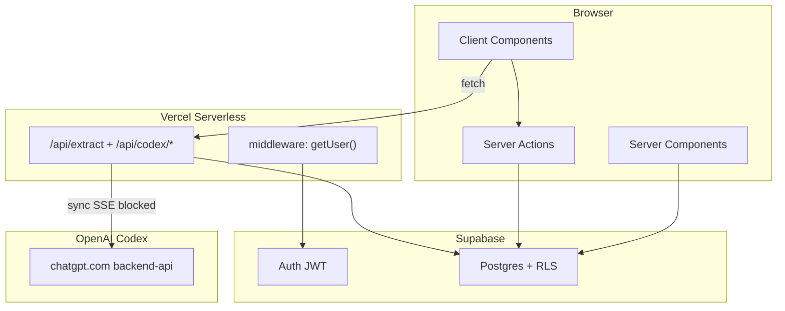

# Lock-In Architecture Review — 100k DAU

**Reviewer lens:** Vercel design review  
**Assumption:** 100,000 daily active users, ~20 page navigations/user/day, moderate AI extraction usage  
**Constraint:** No rebuild. Production-grade incremental improvements only.

---

## Executive Summary

1. **The dashboard will fall over first.** `listApplications()` fetches every row with `select("*")`, including 32KB `raw_description` blobs, on every dashboard load. Power users with hundreds of applications will see multi-second TTFB and multi-megabyte payloads before you reach 100k DAU.

2. **AI extraction is a synchronous choke point.** `/api/extract` holds a Vercel serverless function open for the full Codex SSE round-trip (10–60s), buffers the entire response in memory, and has no queue or timeout. ~500–1,000 concurrent extractions will exhaust function concurrency.

3. **Rate limiting is leaky and the backing table grows forever.** `extraction_usage` is append-only with a check-then-insert race; at scale this becomes millions of rows/month and unreliable burst protection.

4. **OAuth tokens are stored in plaintext** in `codex_connections`, contradicting your own project decisions. A database breach at 100k DAU exposes 100k ChatGPT sessions.

5. **Auth is over-fetched.** Middleware calls `getUser()` on nearly every request, and pages call it again. That's ~2M Supabase Auth round-trips/day from middleware alone at 100k DAU.

**Fix order:** paginated/projected queries → extraction job queue → rate limit hardening → token encryption → middleware scope reduction.

---

## Architecture Snapshot



**Stack:** Next.js 16 App Router · React 19 · Supabase Auth + Postgres (RLS) · BYOK ChatGPT/Codex OAuth · Vercel · no queue · no cache layer · no connection pooler config

---

## What's Fine for Now

- **RLS is correctly scoped.** `applications`, `extraction_usage`, and `codex_connections` all enforce `auth.uid() = user_id`. Server actions don't trust client-supplied `user_id`.
- **Primary index matches the list query.** `(user_id, created_at desc)` on `applications` is the right index for the current sort order.
- **No N+1 query loops.** Detail pages parallelize fetches. No query-inside-`.map()` anti-patterns found.

These are table stakes. They don't scale the app; they mean you have a solid foundation to build on.

---

## Weaknesses

### 1. Unbounded `select("*")` Dashboard Fetch

**Evidence:** `src/lib/applications/queries.ts` (lines 4–9), consumed by `src/app/(dashboard)/dashboard/page.tsx` (lines 7–8).

```ts
// src/lib/applications/queries.ts
.select("*")
.order("created_at", { ascending: false });
```

**Why it's a problem**  
Every dashboard visit loads the user's entire application history into server memory, serializes it into the RSC payload, and hydrates the client. Rows include `raw_description` (up to 32,000 chars per `MAX_RAW_DESCRIPTION` in `src/lib/applications/form.ts`), plus `responsibilities`, `qualifications`, `benefits`, and other large text fields that the table view never displays.

**When it becomes a problem**  
- **~500+ applications per user:** Page loads exceed 5–10MB. TTFB degrades on Vercel cold starts.  
- **~5k DAU with active users:** Supabase egress and Vercel bandwidth costs spike. Postgres buffer cache pressure increases.  
- **Well before 100k DAU** for any user who treats this as a real job tracker.

**How large companies solve it**  
Cursor-based pagination with column projection. List views fetch a slim schema (id, company, job_title, status, dates); detail views fetch the full row on demand. Stripe, Linear, and Notion all paginate list endpoints and never ship blob fields in list responses.

**How you should implement it**  
1. Add `LIST_COLUMNS` constant — omit `raw_description`, `responsibilities`, `qualifications`, `benefits`, `notes`.  
2. Replace `listApplications()` with `listApplicationsPage({ limit: 50, cursor?: string })` using keyset pagination on `(created_at, id)`.  
3. Update `ApplicationsDashboard` to fetch next page via server action or URL search params (`?cursor=`).  
4. Keep `getApplication(id)` as `select("*")` for detail/edit pages only.

**Skill level:** Intermediate

---

### 2. Client-Side Search and Filter Over Full In-Memory Dataset

**Evidence:** `src/components/dashboard/applications-dashboard.tsx` (`matchesSearch()`, lines 35–44); unused GIN index `applications_search_vector_idx` in `supabase/migrations/20260705220000_create_applications.sql` (lines 46–47, 56–69).

**Why it's a problem**  
Search, status filter, work-mode filter, deadline range, and sort all run in the browser over the full dataset loaded in Weakness #1. The `search_vector` tsvector column and GIN index are maintained by a trigger but never queried. You're paying index maintenance cost for zero query benefit.

**When it becomes a problem**  
- **Any user with 200+ applications:** Client-side filter/sort on every keystroke causes jank.  
- **Combined with Weakness #1:** You must load everything before search works, so server-side search doesn't help until pagination is fixed.  
- **At 100k DAU:** Wasted CPU on both server (loading) and client (filtering).

**How large companies solve it**  
Server-side full-text search with indexed columns. Postgres `tsvector` + GIN (you already have this), or `ilike` with trigram indexes for simpler cases. Filters and sort pushed to SQL `WHERE` / `ORDER BY`. Search params in the URL for shareability and back-button support.

**How you should implement it**  
1. After pagination (Weakness #1), add query params: `?q=&status=&workMode=&page=`.  
2. In `listApplicationsPage`, when `q` is set: `.textSearch('search_vector', q, { type: 'websearch' })`.  
3. Add index `(user_id, status)` if status filtering moves server-side.  
4. Remove client-side `matchesSearch` / filter logic; keep only optimistic UI state.

**Skill level:** Intermediate

---

### 3. `extraction_usage` Append-Only Growth + Non-Atomic Rate Limit

**Evidence:** `src/lib/extraction/usage.ts`; migration `supabase/migrations/20260705220000_create_applications.sql` (lines 72–79, 118–127); race in `src/app/api/extract/route.ts` (count at line 69, insert at line 161).

**Why it's a problem**  
Two separate issues:

1. **Table growth:** Every extraction inserts a row. No DELETE policy, no retention job, no partitioning. At 100k DAU with 5 extractions/user/day average = 500k rows/day = 15M rows/month.

2. **Race condition:** Rate limit is check-then-insert, not atomic. Concurrent requests within the same window can exceed the 20/min burst limit (`BURST_EXTRACTIONS_PER_MINUTE` in `src/lib/extraction/constants.ts`).

**When it becomes a problem**  
- **Table growth:** Noticeable index bloat and slower COUNT queries within weeks at moderate DAU.  
- **Race:** Any user who double-clicks "Extract" or opens two tabs. Abuse becomes trivial under load.  
- **~10k DAU:** COUNT-on-append-table per extraction request adds measurable latency.

**How large companies solve it**  
Distributed sliding-window rate limiters (Redis/Upstash) for serverless environments. Vercel's own docs recommend `@upstash/ratelimit` for this exact pattern. For audit logs, time-partitioned tables with automatic retention (drop partitions older than 24h).

**How you should implement it**  
**Option A — Postgres only (minimal deps):**  
```sql
-- Migration: atomic rate check function
CREATE OR REPLACE FUNCTION check_and_record_extraction(p_user_id uuid, p_limit int, p_window interval)
RETURNS boolean AS $$
DECLARE recent_count int;
BEGIN
  SELECT count(*) INTO recent_count FROM extraction_usage
  WHERE user_id = p_user_id AND created_at > now() - p_window;
  IF recent_count >= p_limit THEN RETURN false; END IF;
  INSERT INTO extraction_usage (user_id) VALUES (p_user_id);
  RETURN true;
END;
$$ LANGUAGE plpgsql;
```
Add a `pg_cron` job or Vercel Cron: `DELETE FROM extraction_usage WHERE created_at < now() - interval '24 hours'`.

**Option B — Redis (recommended at scale):**  
Replace `getRecentExtractionCount` / `recordExtraction` with `@upstash/ratelimit` sliding window. Keep `extraction_usage` only for billing analytics with daily rollup, not per-request counting.

**Skill level:** Senior (atomic Postgres) / Intermediate (Redis)

---

### 4. Synchronous Codex Extraction in Serverless Route Handler

**Evidence:** `src/lib/codex/client.ts` (lines 72–94) — `stream: true` in request body but `await response.text()` buffers entire SSE; `src/app/api/extract/route.ts` — synchronous POST holding connection until Codex returns.

**Why it's a problem**  
The extraction route is a long-running synchronous proxy. Vercel serverless functions have execution time limits (10s hobby, 60s pro, 300s enterprise). Codex SSE responses routinely take 10–60 seconds. The function blocks, buffers the full SSE body in memory, parses it, then returns JSON. No timeout, no circuit breaker, no backpressure.

Your server becomes the bottleneck for every user's ChatGPT subscription. You pay for function duration; users pay with tail latency.

**When it becomes a problem**  
- **~50 concurrent extractions:** Function concurrency queueing begins.  
- **~500 concurrent:** Vercel concurrency limits hit; 503s cascade.  
- **~1k concurrent:** OpenAI may rate-limit or block the unofficial Codex OAuth path entirely.

**How large companies solve it**  
Async job pattern: accept work, return immediately, process in background worker, client polls or subscribes for result. OpenAI's own API uses this for long-running tasks. Vercel recommends Inngest, Trigger.dev, or Supabase Edge Functions + queue table for serverless workloads that exceed HTTP timeout budgets.

**How you should implement it**  
1. Create `extraction_jobs` table: `(id, user_id, status, input_hash, result jsonb, error, created_at, completed_at)`.  
2. `POST /api/extract` → insert job row, return `202 { jobId }` in <200ms.  
3. Worker (Supabase Edge Function, Vercel Cron poller, or Inngest function) picks up pending jobs, calls `sendCodexMessage`, writes result.  
4. Client polls `GET /api/extract/[jobId]` every 2s, or subscribe via Supabase Realtime on the job row.  
5. Add `AbortSignal.timeout(30_000)` to the Codex fetch immediately, even before the full async migration.

**Skill level:** Senior

---

### 5. Plaintext OAuth Tokens in Postgres

**Evidence:** `supabase/migrations/20260706040000_create_codex_connections.sql` (lines 4–5); `src/lib/codex/session.ts` `saveCodexTokens()` (lines 132–136); contradicts `docs/PROJECT_DECISIONS.md` ("tokens never in Supabase plaintext columns").

**Why it's a problem**  
`access_token` and `refresh_token` are stored as plain `text` columns. RLS prevents cross-user reads, but does not protect against: Supabase dashboard access, service-role key leak, SQL injection bypassing RLS, database backup exposure, or insider threat. At 100k DAU, a breach exposes 100k active ChatGPT sessions — a credential incident, not a data incident.

**When it becomes a problem**  
- **Immediately** from a security audit perspective.  
- **At any DAU** if you pursue SOC 2, GDPR Article 32, or any enterprise customer.  
- **At 100k DAU** the blast radius is large enough to be newsworthy.

**How large companies solve it**  
Application-level encryption (AES-256-GCM) with keys in a secrets manager (Vercel env, AWS KMS, HashiCorp Vault). Envelope encryption for key rotation. Some teams use Supabase Vault (`pgsodium`) for column-level encryption. OAuth refresh tokens stored encrypted; access tokens kept in memory only with short TTL.

**How you should implement it**  
1. Add `TOKEN_ENCRYPTION_KEY` env var (32-byte base64).  
2. Create `src/lib/crypto/tokens.ts`: `encrypt(plaintext) → { ciphertext, iv, tag }`, `decrypt(...) → plaintext` using `node:crypto` `createCipheriv` / `createDecipheriv` with AES-256-GCM.  
3. In `saveCodexTokens`, encrypt before upsert. In `getCodexTokens`, decrypt after select.  
4. Migration: add `access_token_enc`, `refresh_token_enc` columns; backfill script; drop plaintext columns.  
5. Verify `codex_connections` RLS policy exists (it does: "Users manage own codex connection" in migration).

**Skill level:** Senior

---

### 6. Middleware `getUser()` on Every Request + Duplicate Auth Calls

**Evidence:** `src/lib/supabase/middleware.ts` (line 39); matcher in `src/middleware.ts` (lines 9–11) covers nearly all routes; duplicate calls in `src/lib/auth/session.ts`, `src/app/(dashboard)/layout.tsx` (line 11), and every dashboard page (e.g. `dashboard/page.tsx` line 7).

**Why it's a problem**  
Every page navigation — including `/`, `/login`, `/manifesto`, static assets in the matcher — triggers a Supabase Auth `getUser()` network round-trip in middleware. Then protected pages call `requireUser()` or `getAuthUser()` again. That's 2–3 auth validations per dashboard page load.

**When it becomes a problem**  
- **100k DAU × 20 navigations/day ≈ 2M middleware auth calls/day** minimum.  
- **Supabase Auth rate limits** and latency become a platform dependency for every page view.  
- **Cold middleware invocations** add 50–200ms to every request on Vercel edge.

**How large companies solve it**  
Narrow auth checks to routes that need them. Trust JWT claims locally after initial validation (Supabase session cookie). Pass authenticated user from layout to children via React context instead of re-fetching. Use `getSession()` (local JWT parse) in middleware for route gating; reserve `getUser()` (server validation) for mutations and sensitive reads.

**How you should implement it**  
1. Narrow `middleware.ts` matcher to protected prefixes only:
   ```ts
   matcher: ['/dashboard/:path*', '/applications/:path*', '/settings/:path*', '/admin/:path*', '/api/:path*']
   ```
2. In dashboard layout, call `requireUser()` once and pass `user` via a server context or props — remove per-page `requireUser()` calls.  
3. Evaluate `getSession()` vs `getUser()` in middleware per [Supabase SSR guidance](https://supabase.com/docs/guides/auth/server-side/nextjs) — `getSession()` is cheaper for redirect gating.

**Skill level:** Intermediate

---

### 7. Middleware Silently Bypasses Auth When Env Vars Missing

**Evidence:** `src/lib/supabase/middleware.ts` (lines 14–16):

```ts
if (!supabaseUrl || !supabaseAnonKey) {
  return NextResponse.next({ request });
}
```

**Why it's a problem**  
A misconfigured deployment (missing env vars, typo in Vercel dashboard, failed preview deploy) silently disables all auth protection. Protected routes become publicly accessible. RLS still guards data at the database layer, but the app renders authenticated UI shells and may leak metadata. This fails open; production systems fail closed.

**When it becomes a problem**  
- **First misconfigured deploy.** Not a scale issue — an ops issue.  
- **At 100k DAU** the cost of a silent auth bypass is catastrophic.

**How large companies solve it**  
Fail closed: crash the build or return 500 if required env vars are missing in production. Validate env at startup with a schema (Zod + `@t3-oss/env-nextjs` or a simple `src/env.ts`). Vercel build step fails if validation doesn't pass.

**How you should implement it**  
1. Create `src/env.ts` with Zod schema validating all required env vars.  
2. Import and parse at module load in `next.config.ts` or a root `instrumentation.ts`.  
3. In middleware, replace silent bypass with `throw new Error('Missing Supabase env')` when `NODE_ENV === 'production'`.  
4. Add `.env.example` to the repo (README references it but file is missing).

**Skill level:** Beginner

---

### 8. No Rate Limiting on Codex OAuth Poll/Start Routes

**Evidence:** `src/app/api/codex/auth/poll/route.ts` — no rate limit; `src/components/codex/login-with-chatgpt.tsx` (line 68) polls every `intervalSeconds` (default ~5s) during device auth.

**Why it's a problem**  
During ChatGPT OAuth, the client hammers `POST /api/codex/auth/poll` every 5 seconds. Each poll calls `pollDeviceAuth()` which hits OpenAI's device authorization endpoint. No per-user, per-IP, or global rate limit on `/api/codex/auth/*`. A botnet or misconfigured client loop can generate unbounded outbound OpenAI API calls billed to your server's reputation.

**When it becomes a problem**  
- **~1k concurrent OAuth flows:** Thousands of poll requests/minute to your server and OpenAI.  
- **Abuse scenario:** Any authenticated user can trigger unlimited polls.  
- **Before 100k DAU** if OAuth onboarding is a funnel step for all new users.

**How large companies solve it**  
Per-route rate limits with sliding windows. Exponential backoff on the client. Cap concurrent pending device auths per user (max 1). IP-based limits on unauthenticated endpoints; user-based limits on authenticated ones.

**How you should implement it**  
1. Add `@upstash/ratelimit` to `/api/codex/auth/poll` (e.g. 30 requests/min per user).  
2. In `login-with-chatgpt.tsx`, implement exponential backoff: `interval * 1.5^attempt`, cap at 30s.  
3. Reject new `start` requests if user already has a pending device auth cookie.  
4. Return `429` with `Retry-After` header.

**Skill level:** Intermediate

---

### 9. Admin Page Loads Entire User Directory Into Memory

**Evidence:** `src/lib/admin/queries.ts` `listAllUsers()` (lines 12–49) — paginates at 1000/page but accumulates all users into a single array; rendered by `src/app/(dashboard)/admin/page.tsx`.

**Why it's a problem**  
At 100k users, this makes 100 sequential Supabase Admin API calls, holds the entire user directory in server memory, and ships it to the client for rendering. Admin API has its own rate limits. Page load time grows linearly with user count.

**When it becomes a problem**  
- **~10k users:** Admin page takes 10+ seconds.  
- **~100k users:** Likely times out on Vercel serverless (60s limit).  
- **Only affects admin**, but admin is you — and it blocks incident response when you need it most.

**How large companies solve it**  
Server-side paginated admin tables with search. Never ship full user lists to the client. At scale, admin operations move to internal tools (Retool, Supabase Dashboard, custom ops CLI) instead of in-app pages.

**How you should implement it**  
1. Change `listAllUsers({ page, perPage, emailPrefix? })` to return one page + total count.  
2. Update `users-table.tsx` with pagination controls and email search input.  
3. Long-term: remove in-app admin entirely; use Supabase Dashboard for user ops at scale.

**Skill level:** Beginner

---

### 10. Account Deletion Documented but Not Implemented

**Evidence:** `docs/PROJECT_DECISIONS.md` ("Cascade delete applications; clear AI cookies"); `docs/legal/PRIVACY_POLICY.md` (line 72: "use in-app account deletion (when available)"); no deletion code in codebase.

**Why it's a problem**  
GDPR Article 17 (right to erasure) and CCPA require a deletion mechanism. Your privacy policy promises it. Users cannot delete their account. FK cascades on `applications` and `codex_connections` are already configured (`on delete cascade`), but no UI or API triggers `auth.users` deletion.

**When it becomes a problem**  
- **First GDPR/CCPA request.**  
- **At 100k DAU:** Regulatory risk scales with user count. One complaint to a DPA triggers an audit.  
- **Trust:** Users who can't leave don't trust the product.

**How large companies solve it**  
Self-service account deletion in settings with confirmation dialog. Soft-delete grace period (30 days) optional. Hard delete cascades via FK. Audit log of deletion requests. Email confirmation before irreversible action.

**How you should implement it**  
1. Add "Delete account" in `src/app/(dashboard)/settings/page.tsx` with typed confirmation ("type DELETE to confirm").  
2. Server action `deleteAccount()` using service-role client: `supabase.auth.admin.deleteUser(userId)`. Cascades handle `applications`, `codex_connections`, `extraction_usage`.  
3. Call `/auth/signout` and redirect to `/`.  
4. Update privacy policy to remove "(when available)".

**Skill level:** Intermediate

---

### 11. Aggressive `revalidatePath` on Hot Mutation Path

**Evidence:** `src/lib/applications/actions.ts` — `patchApplication()` calls `revalidatePath("/dashboard")` on every inline status change (line 197). `createApplication`, `updateApplication`, `deleteApplication` also revalidate.

**Why it's a problem**  
`patchApplication` is called on every status dropdown change in the dashboard. Each call invalidates the entire dashboard cache and triggers a full server re-render + `listApplications()` re-fetch (Weakness #1). The client already does optimistic updates in `applications-dashboard.tsx`. You're paying for a full page data refetch on every click.

**When it becomes a problem**  
- **Active users changing statuses frequently:** Unnecessary DB load and RSC re-renders.  
- **Combined with Weakness #1:** Each revalidation re-fetches all applications with all columns.  
- **At scale:** Amplifies read load multiplicatively.

**How large companies solve it**  
Optimistic UI with server-returned entity — no cache invalidation for partial updates. Full revalidation only on create/delete. Tag-based cache (`revalidateTag('applications')`) for targeted invalidation when needed.

**How you should implement it**  
1. Remove `revalidatePath("/dashboard")` from `patchApplication` — the returned `application` row already updates client state.  
2. Keep `revalidatePath` on `createApplication` and `deleteApplication` (structural changes).  
3. If you add caching (Weakness #12), use `revalidateTag('applications-${userId}')` instead of path-based invalidation.

**Skill level:** Intermediate

---

### 12. No Caching Layer for Read-Heavy Dashboard

**Evidence:** No `unstable_cache`, no `export const revalidate`, no `Cache-Control` headers, no Redis. Every dashboard load hits Supabase fresh.

**Why it's a problem**  
The dashboard is the most-visited page. Application data changes infrequently (status updates a few times/day per user) but is re-fetched on every navigation. At 100k DAU with 20 page views/day, that's 2M uncached database reads/day for a dataset that changes maybe 2–3 times/day per user.

**When it becomes a problem**  
- **~10k DAU:** Noticeable Supabase bill increase.  
- **~50k DAU:** Database CPU from redundant reads becomes a line item.  
- **At 100k DAU:** Caching is not optional for read-heavy personalized pages.

**How large companies solve it**  
Short-TTL cache for personalized data (30–60s). Tag-based invalidation on writes. CDN caching only for public/static content. `unstable_cache` or Next.js `use cache` directive for server-side data caching with per-user cache keys.

**How you should implement it**  
1. Wrap `listApplicationsPage` in `unstable_cache` with key `['applications', userId, cursor, filters]` and `{ revalidate: 60, tags: ['applications-${userId}'] }`.  
2. On mutations, call `revalidateTag('applications-${userId}')`.  
3. Public pages (`/`, `/manifesto`): add `export const revalidate = 3600` for static generation where possible.

**Skill level:** Intermediate

---

### 13. Observability Is a Hand-Rolled Sentry Envelope with No Tracing or Sampling

**Evidence:** `src/lib/monitoring.ts` — manual Sentry envelope POST, no SDK, no performance tracing, no sampling, no breadcrumbs, no release tracking.

**Why it's a problem**  
You cannot diagnose production incidents at 100k DAU with `console.error` in dev and fire-and-forget envelope posts in prod. No latency breakdown for `/api/extract`. No error grouping. No alert on error rate spikes. No correlation between user actions and failures. The hand-rolled envelope doesn't capture stack traces reliably.

**When it becomes a problem**  
- **First production incident you can't diagnose.**  
- **At 100k DAU:** Error volume without sampling will overwhelm Sentry quota and your ability to find signal.  
- **Codex extraction failures:** You need per-step timing (auth refresh, Codex call, parse, save) to know where timeouts happen.

**How large companies solve it**  
`@sentry/nextjs` with performance monitoring, error sampling (1–5%), release tracking, and structured logging. Vercel Log Drains to Datadog/Axiom. Supabase Dashboard for slow query analysis. Synthetic monitoring for critical paths.

**How you should implement it**  
1. Replace `src/lib/monitoring.ts` with `@sentry/nextjs` — keep `reportError` as a thin wrapper for call-site compatibility.  
2. Add `Sentry.startSpan()` around Codex fetch, token refresh, and DB operations in `/api/extract`.  
3. Set `tracesSampleRate: 0.05` in production.  
4. Enable Vercel Log Drains. Turn on Supabase query insights.

**Skill level:** Intermediate

---

### 14. Global Client Bundle: Framer Motion in Root Layout

**Evidence:** `src/app/layout.tsx` (line 43) imports `LockInIntro` — a `"use client"` component using Framer Motion — on every route including `/login`, `/dashboard`, and `/api` error pages.

**Why it's a problem**  
Framer Motion (~30KB gzipped) loads on every page, including authenticated dashboard pages where the intro animation is irrelevant. `lucide-react` icons are imported without tree-shaking optimization. No `optimizePackageImports` in `next.config.ts`. `shadcn` CLI package is in `dependencies` instead of `devDependencies`.

**When it becomes a problem**  
- **Mobile users on slow connections:** Every page load pays the motion tax.  
- **At 100k DAU:** Wasted bandwidth scales linearly. Core Web Vitals (LCP, TTI) degrade.  
- **Not a server crisis**, but a real user-perceived performance issue.

**How large companies solve it**  
Route-level code splitting. Dynamic imports with `ssr: false` for animations. `optimizePackageImports` for icon libraries. Bundle size budgets in CI. Lazy-load below-the-fold and non-critical UI.

**How you should implement it**  
1. `const LockInIntro = dynamic(() => import('@/components/motion/lock-in-intro').then(m => m.LockInIntro), { ssr: false })` in root layout.  
2. Add to `next.config.ts`:
   ```ts
   experimental: { optimizePackageImports: ['lucide-react', 'framer-motion'] }
   ```
3. Move `shadcn` to `devDependencies`.  
4. Add `@next/bundle-analyzer` to CI (warn on >10% regression).

**Skill level:** Beginner

---

### 15. Single-Region Postgres Without Connection Pooling Discipline

**Evidence:** `src/lib/supabase/server.ts` creates a new Supabase client per request with direct Postgres connection (port 5432, not pooler port 6543). No Supavisor/pooler URL documented. No connection limit configuration.

**Why it's a problem**  
Vercel serverless creates a new function instance per request under load. Each instance opens a Postgres connection. Supabase free/pro tiers have connection limits (60–200 direct connections). At 100k DAU with concurrent dashboard loads, extraction jobs, and middleware auth calls, you will exhaust the connection pool. Queries queue, timeouts cascade.

**When it becomes a problem**  
- **~5k concurrent serverless invocations:** Connection limit approached on Supabase Pro.  
- **~50k DAU:** Regular "too many connections" errors during peak hours.  
- **At 100k DAU:** This is a hard ceiling without pooling — not a gradual degradation.

**How large companies solve it**  
Connection pooler (PgBouncer/Supavisor) in transaction mode for serverless. Separate pooler URL for app queries, direct connection only for migrations. Read replicas when read QPS exceeds single-node capacity. Connection monitoring via `pg_stat_activity`.

**How you should implement it**  
1. In Supabase Dashboard → Settings → Database, copy the **connection pooler** URL (port 6543, `?pgbouncer=true`).  
2. Set `DATABASE_URL` or configure Supabase client to use pooler URL for all server-side queries.  
3. Set Supabase max connections based on your plan. Monitor via Supabase observability.  
4. **Do not add read replicas yet** — premature at current scale. Revisit when dashboard read QPS exceeds ~1k/sustained.  
5. Document the pooler requirement in README and `.env.example`.

**Skill level:** Staff

---

## Recommended Sequencing

### Phase 1 — Before 10k DAU (~1 week)

| Task | Weakness | Files |
|------|----------|-------|
| Paginated + projected `listApplicationsPage` | #1 | `queries.ts`, `dashboard/page.tsx`, `applications-dashboard.tsx` |
| Fail-closed env validation + `.env.example` | #7 | `src/env.ts`, `middleware.ts` |
| `extraction_usage` retention cron + atomic rate check | #3 | New migration, `usage.ts` |
| `AbortSignal.timeout` on Codex fetch | #4 | `codex/client.ts` |
| Remove `revalidatePath` from `patchApplication` | #11 | `actions.ts` |

### Phase 2 — Before 50k DAU (~2–3 weeks)

| Task | Weakness | Files |
|------|----------|-------|
| Async extraction job queue | #4 | New `extraction_jobs` table, worker, API routes |
| Upstash Redis rate limiting | #3, #8 | `usage.ts`, `api/codex/auth/*` |
| Token encryption at rest | #5 | `crypto/tokens.ts`, `codex/session.ts`, migration |
| Narrow middleware matcher | #6 | `middleware.ts` |
| Server-side search/filter | #2 | `queries.ts`, `applications-dashboard.tsx` |

### Phase 3 — Before 100k DAU (~2 weeks)

| Task | Weakness | Files |
|------|----------|-------|
| Connection pooler configuration | #15 | `supabase/server.ts`, README, `.env.example` |
| `@sentry/nextjs` + performance tracing | #13 | `monitoring.ts`, `next.config.ts` |
| `unstable_cache` on list queries | #12 | `queries.ts`, `actions.ts` |
| Account deletion flow | #10 | `settings/page.tsx`, new server action |
| Admin pagination | #9 | `admin/queries.ts`, `users-table.tsx` |
| Bundle optimization | #14 | `layout.tsx`, `next.config.ts` |

---

## Out of Scope

The following are explicitly **not** recommended:

- **Rewriting the app** in another framework or language.
- **Migrating off Supabase** to self-hosted Postgres, PlanetScale, or DynamoDB.
- **Adding Kubernetes** or dedicated servers for a serverless-first workload.
- **Adding Supabase Storage** for text blobs (Postgres text columns are fine at this scale once list queries stop fetching them).
- **Adding Supabase Realtime** for dashboard sync (last-write-wins is acceptable for a single-user job tracker).
- **Building a billing/subscription system** (Stripe was removed; revisit only if monetizing).
- **Multi-region deployment** (single-region Supabase + Vercel is correct until ~500k DAU).
- **Read replicas** (premature until dashboard read QPS is measured and exceeds single-node capacity).

---

## Appendix: File Reference Index

| File | Role |
|------|------|
| `src/lib/applications/queries.ts` | Dashboard data fetching (Weakness #1, #2) |
| `src/app/(dashboard)/dashboard/page.tsx` | Dashboard page (Weakness #1) |
| `src/components/dashboard/applications-dashboard.tsx` | Client-side filter/search (Weakness #2) |
| `src/lib/extraction/usage.ts` | Rate limit backing store (Weakness #3) |
| `src/app/api/extract/route.ts` | Sync extraction endpoint (Weakness #3, #4) |
| `src/lib/codex/client.ts` | Codex SSE client (Weakness #4) |
| `src/lib/codex/session.ts` | Token storage (Weakness #5) |
| `src/lib/supabase/middleware.ts` | Auth middleware (Weakness #6, #7) |
| `src/middleware.ts` | Middleware matcher (Weakness #6) |
| `src/app/api/codex/auth/poll/route.ts` | OAuth polling (Weakness #8) |
| `src/lib/admin/queries.ts` | Admin user list (Weakness #9) |
| `src/lib/applications/actions.ts` | Server actions (Weakness #11) |
| `src/lib/monitoring.ts` | Error reporting (Weakness #13) |
| `src/app/layout.tsx` | Root layout bundle (Weakness #14) |
| `src/lib/supabase/server.ts` | DB client (Weakness #15) |
| `supabase/migrations/20260705220000_create_applications.sql` | Schema + indexes |
| `supabase/migrations/20260706040000_create_codex_connections.sql` | Token storage schema |
