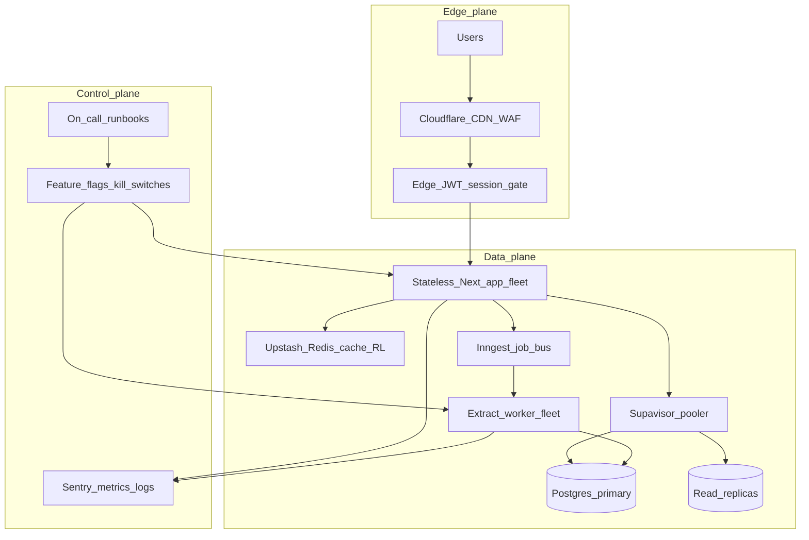

# Lock-In Viral Scale-Up Plan (Company-Grade RFC)

**Status:** Architecture RFC (portfolio)  
**Author lens:** Staff / Founding Engineer — production incident response after viral growth  
**Goal:** Survive and then own **millions of users’ traffic** without melting the product  
**Related:** [100k DAU review](ARCHITECTURE_REVIEW_100K_DAU.md) · [1M concurrent design blog](blog/scaling-to-one-million-concurrent-users.md) · [Architecture](ARCHITECTURE.md)

> **How to use this on a resume:** Frame as *“Designed and documented a viral-growth scale-up architecture for a production Next.js + Supabase app — async AI job pipeline, edge/CDN, Redis rate limits, cell-based multi-region path, SLOs and load-shed.”* This RFC is the design; Phase 1 hardening is already in the codebase.

---

## 0. Executive decision (what a real company does first)

When traffic goes viral, **do not** start by buying AWS or rewriting the app.

| Priority | Action | Why |
|----------|--------|-----|
| P0 | **Protect the core loop** (login, dashboard read, create/edit application) | Users forgive slow AI; they do not forgive a dead app |
| P0 | **Load-shed AI extract** (queue + 429 + fair quotas) | Sync extract is the concurrency bomb today |
| P0 | **Observability + kill switches** | You cannot scale what you cannot see or turn off |
| P1 | **Decouple long work from HTTP** | Web CCU ≠ extract throughput |
| P1 | **Cache + pooler + CDN** | Cut origin and DB load by 10–100× on reads |
| P2 | **Multi-region / cells** | Survive regional failure and noisy neighbors |
| P3 | **Dedicated cloud / Docker workers** | Only when managed free/paid tiers are the bottleneck |

**Docker / AWS / GCP are not day-one.** Early scale runs on **Vercel + Supabase + Cloudflare + Upstash + Inngest**. Containers and hyperscalers appear when you need **dedicated worker fleets or multi-region cells** — same architecture, bigger dials.

---

## 1. Traffic model (millions of people)

| Metric | Target envelope | Notes |
|--------|-----------------|-------|
| Monthly active users | 5M–20M | Viral consumer SaaS band |
| Peak DAU | ~1M–3M | Spiky social / launch days |
| Peak concurrent (browsing) | ~50k–200k | ~2–5% of peak DAU online same minute |
| Peak concurrent extracts | Product-capped | Queue depth + worker pool, never unbounded |
| Read:write ratio | ~50:1–100:1 | Job trackers are read-heavy |
| Extract share of requests | &lt;5% of API calls | Must not consume &gt;5% of web capacity |

**Product rule:** AI extract is a **best-effort async feature**, not on the critical path for “app is up.”

---

## 2. Service-level objectives (run the company)

| SLO | Target | Breach response |
|-----|--------|-----------------|
| Availability (core writes/reads) | 99.9% monthly | Page on-call; freeze deploys; shed extract |
| Dashboard p95 TTFB | &lt;500ms (cached), &lt;1.5s (uncached) | Raise cache TTL; scale read replicas |
| Extract enqueue p95 | &lt;200ms | If slower, Redis/DB incident |
| Extract completion p95 | &lt;60s (queued + work) | Scale workers; degrade prompt; pause new jobs |
| Error rate (5xx) | &lt;0.5% | Auto load-shed non-critical routes |
| Auth success | &gt;99.5% | Failover Auth region / degrade to cached JWT gate |

---

## 3. Target production architecture



### Planes (how serious companies think)

| Plane | Owns | Failure mode |
|-------|------|--------------|
| **Edge** | CDN, WAF, TLS, bot fight, static | Origin never sees most traffic |
| **Control** | Flags, quotas, on-call, deploy freezes | Can turn extract off globally in seconds |
| **Data** | App, Redis, queue, Postgres, workers | Scales horizontally; DB is the precious resource |

You do **not** need to operate Kubernetes on day one. You **do** need these three planes conceptually — even if each plane is a managed SaaS.

---

## 4. The best scale-up system (ordered workstreams)

### Workstream A — Survive the spike (hours)

1. **Global kill switch:** `EXTRACT_ENABLED=false` via env/flag → extract returns friendly “high demand, queued later.”
2. **Hard global rate limit** in Redis (per IP + per user + global QPS budget).
3. **Cloudflare** in front: cache public pages, challenge bots, shield origin.
4. **Freeze risky deploys;** only hotfix branch ships.
5. **Status page + banner** in-app: set expectations (AI delayed, core tracker up).

### Workstream B — Unblock concurrency (days)

| Change | Repo touchpoint | Outcome |
|--------|-----------------|--------|
| Async extract | `src/app/api/extract/route.ts` → `202` + job id | HTTP no longer waits on Codex |
| Job table + worker | `extraction_jobs` + Inngest | Throughput = workers, not function slots |
| Redis rate limit | `src/lib/extraction/usage.ts` | Stops Postgres COUNT as hot path |
| Encrypt tokens | `src/lib/codex/session.ts` | Credential blast radius under scrutiny |
| Narrow auth middleware | `src/middleware.ts` | Cut Auth QPS during navigation storms |

### Workstream C — Make reads cheap (1–2 weeks)

| Change | Outcome |
|--------|---------|
| Cache tags on `listApplicationsPage` (30–60s TTL) | Dashboard storms hit Redis/CDN, not Postgres |
| Supabase **pooler :6543** for all app traffic | No connection stampede from serverless |
| Read replicas for list/search | Primary reserved for writes + jobs |
| Server-side search on existing GIN `search_vector` | Stop shipping full client-side filter sets |
| CDN for `/`, `/manifesto`, legal, static assets | Origin capacity for authenticated API only |

### Workstream D — Operate like a company (ongoing)

| Practice | Tooling (start free / cheap → paid) |
|----------|-------------------------------------|
| Errors + traces | Sentry |
| Product analytics (privacy-safe) | Vercel Analytics / PostHog free tier |
| Feature flags / kill switches | Env flags first → LaunchDarkly / Unleash later |
| Load / chaos tests | k6 scripts against staging before every big launch |
| Runbooks | One page per symptom: 5xx spike, queue backlog, Auth outage, DB CPU |
| On-call | Single engineer rotation + severity definitions (SEV1–SEV3) |

### Workstream E — Hyperscale envelope (months, if growth holds)

| Pattern | What it means for Lock-In |
|---------|---------------------------|
| **Cell-based architecture** | Users hashed into cells (cell-a, cell-b…), each with own DB + worker pool. Blast radius = one cell. |
| **Multi-region active-active (edge)** | Cloudflare + regional app; sticky user→home region for writes |
| **Official AI API path** | Replace unofficial Codex OAuth if ToS/reliability becomes SEV risk |
| **Dedicated workers** | Dockerized workers on **Fly.io** / ECS / Cloud Run when Inngest cost or limits bite |
| **Partition hot tables** | `extraction_jobs` / `extraction_usage` by time; `applications` by `user_id` hash if a cell grows too large |
| **Load-shed hierarchy** | 1) bots 2) extract enqueue 3) search 4) writes last |

**AWS/GCP/Docker enter here** as *implementation of cells and workers*, not as a rewrite of the product.

---

## 5. Recommended stack (best-of-breed, cost-aware)

Prefer products that (a) have a free tier to start, (b) scale by upgrading the same API, (c) are what production teams actually use.

| Concern | Primary choice | Why it’s “company grade” | Upgrade when… |
|---------|----------------|--------------------------|---------------|
| Edge / CDN / WAF | **Cloudflare** | Industry default shield | Need advanced bot / Argo |
| App | **Vercel** (then hybrid) | Matches Next.js; short handlers | Need long-lived custom runtimes |
| Auth + Postgres + RLS | **Supabase** | Already the system of record | Need dedicated / multi-region DB |
| Pooling | **Supavisor** (Supabase pooler) | Serverless-safe connections | Always — configure early |
| Cache + rate limit | **Upstash Redis** | Global, serverless-native | Command/QPS limits |
| Jobs | **Inngest** → **BullMQ + Redis** | Fast to ship async; escape hatch is open source | Cost / lock-in / custom scaling |
| Workers (later) | **Fly.io** or **Cloud Run** (Docker) | Real horizontal extract fleet | Queue lag under viral extract usage |
| Objects (later) | **Cloudflare R2** | Cheap egress for large JD blobs | Postgres egress dominates bill |
| Observability | **Sentry** + provider metrics | Traces on enqueue→worker→Codex | Need full APM (Datadog/Axiom) |
| Flags | Env → **Unleash** (OSS) / LaunchDarkly | Instant extract kill switch | Multi-team flag governance |

**What you are not buying on day one:** EKS/GKE, Kafka, service mesh, multi-AZ Terraform empires. Those are resume fluff unless cells and event volume justify them.

---

## 6. Capacity math (interview-ready)

**Today (sync extract):**

```
extract_CCU ≈ Vercel_function_slots   # ~50–500 before pain
```

**After async redesign:**

```
web_CCU        ≈ edge_cache_hit_rate × short_handler_capacity
extract_QPS    ≈ worker_count / avg_job_seconds
safe_enqueue   ≈ min(redis_budget, db_write_budget, product_quota)
```

**Company control knob:** product quotas (`N` extracts/user/day, global max queue depth). Architecture enables scale; **product policy** prevents infinite spend.

---

## 7. Rollout plan (what “we shipped after we went viral” looks like)

| Phase | Timebox | Ship | Resume bullet |
|-------|---------|------|---------------|
| **Stabilize** | 0–48h | Kill switch, Cloudflare, Redis global RL, status banner | “Stabilized viral traffic; protected core CRUD under peak load” |
| **Decouple** | Week 1 | Async extract + Inngest + job UX | “Converted sync AI path to async job pipeline (202 + workers)” |
| **Harden** | Week 2–3 | Pooler, cache tags, token encryption, Sentry traces, middleware narrow | “Cut Auth/DB amplification; encrypted OAuth tokens at rest” |
| **Prove** | Week 4 | k6 load test to N× current peak; runbooks | “Load-tested to Nx peak; published SEV runbooks” |
| **Scale-out** | Month 2+ | Replicas, CDN everywhere, worker autoscaling | “Scaled read path with replicas + CDN; autoscaled workers” |
| **Cells** | When one DB is the wall | User-hash cells + regional failover | “Designed cell-based multi-tenant isolation for blast-radius control” |

---

## 8. Code checklist (mapped to Lock-In)

- [ ] Feature flag `EXTRACT_ENABLED` + global Redis budget
- [ ] `POST /api/extract` → enqueue only (`202`)
- [ ] `extraction_jobs` + poll/Realtime client
- [ ] Inngest (or BullMQ) worker calling existing Codex client + 30s timeout
- [ ] Upstash sliding-window limits (user + IP + global)
- [ ] Cache tags on list queries; invalidate on mutate
- [ ] Pooler URL in production env
- [ ] Encrypt `codex_connections` tokens
- [ ] Narrow middleware matcher; edge JWT for route gates
- [ ] Sentry spans: enqueue → refresh → Codex → persist
- [ ] Server-side `search_vector` search
- [ ] k6 scenario pack + staging soak test
- [ ] SEV1–SEV3 runbooks in `docs/runbooks/` (when implementing)

---

## 9. Explicit non-goals (keeps the plan elite, not bloated)

- Rewriting in another language/framework
- Moving off Postgres before cells are proven necessary
- Kafka / event sourcing for application CRUD
- Real-time collaborative editing
- Building a custom auth system
- Multi-cloud active-active on day one

---

## 10. One-paragraph resume narrative

> After designing Lock-In for production (RLS, fail-closed config, atomic rate limits, paginated reads), I authored a company-grade viral scale-up RFC: protect core CRUD first, load-shed AI, move extraction to an async worker bus, put Cloudflare + Redis in front of origin, pool and replicate Postgres, then grow into cell-based multi-region isolation. Stack stays managed and cost-aware (Vercel, Supabase, Cloudflare, Upstash, Inngest) with a clear path to Dockerized worker fleets on Fly/Cloud Run when viral extract volume demands it.

---

*This document is the operating plan. Implementation of Workstreams B–E is roadmap work; Phase 1 foundation already lives in the repo ([ENGINEERING_HIGHLIGHTS.md](ENGINEERING_HIGHLIGHTS.md)).*
