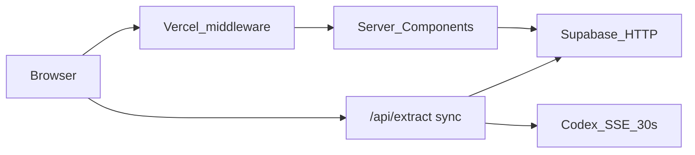
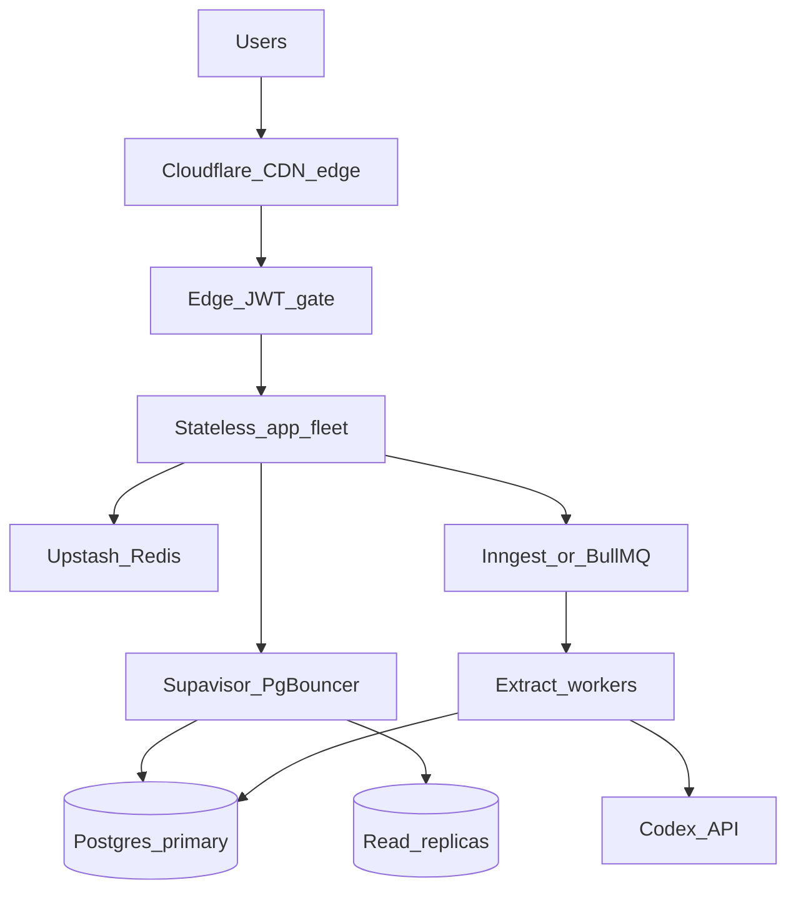

# Scaling Lock-In Toward One Million Concurrent Users

**Audience:** engineers and recruiters who want an honest capacity story — what the app can do today, what blocks growth, and how to redesign the stack for extreme scale without rewriting everything.

**Disclaimer:** No load testing has been run on Lock-In. Numbers below are **estimates** from architecture review of this codebase. “1M concurrent users” (people actively hitting the system in the same second) is a **stretch target**. A more realistic product milestone for a job tracker is **1M DAU** with tens of thousands concurrent. Free tiers are for building and early traffic; true 1M CCU requires paid multi-region capacity.

---

## 1. Current system

Lock-In is a Next.js App Router job-application tracker. Users sign in, store applications in Postgres, and optionally run AI field extraction against a job description using their own ChatGPT/Codex OAuth tokens.

| Layer | Choice today |
|-------|----------------|
| UI / app | Next.js 16 App Router, React 19 |
| Hosting | Vercel (serverless functions + cron) |
| Auth + DB | Supabase Auth, Postgres, Row Level Security |
| AI | Sync `POST /api/extract` → Codex SSE (up to 30s timeout) |
| Rate limit | Postgres RPC `check_and_record_extraction` (20 bursts/min per user) |
| Dashboard | Keyset pagination + column projection (50 slim rows/page) |



### What already works well

- **RLS** scopes every user table to `auth.uid() = user_id`.
- **Dashboard lists** no longer `select("*")` unbounded blobs — `listApplicationsPage` projects slim columns and paginates on `(created_at, id)`.
- **Extraction rate limiting** is atomic (advisory lock + insert), with a Vercel Cron purging `extraction_usage` older than 24 hours.
- **Codex fetch** aborts at 30 seconds so serverless functions do not hang until the platform kills them.
- **Env validation** fails closed at startup so misconfigured deploys do not silently disable auth.

Those Phase 1 fixes buy comfortable daily traffic in the **~5k–10k DAU** range for browsing-heavy use. They do **not** remove the concurrency wall on AI extraction.

### What is still missing for scale

- No **async job queue** — extract holds the HTTP request open for the full Codex round-trip.
- No **Redis** (or equivalent) for global rate limits and short-TTL cache.
- No documented **connection pooler** discipline (Supavisor / port 6543) for serverless stampede scenarios.
- Middleware still leans on **`getUser()`** for session work on matched routes (Auth QPS tax under heavy navigation).
- Codex OAuth tokens in `codex_connections` are still **plaintext at rest**.
- GIN `search_vector` exists but **server-side search is not wired** yet.

Primary sources in-repo: [ARCHITECTURE.md](../ARCHITECTURE.md), [README capacity table](../../README.md), [ARCHITECTURE_REVIEW_100K_DAU.md](../ARCHITECTURE_REVIEW_100K_DAU.md).

---

## 2. What exactly limits users today

**Browsing users** (dashboard, forms, status edits) and **extracting users** hit different ceilings. The product’s hard concurrency wall is the sync AI path.

| Bottleneck | Ceiling (estimate) | Why |
|------------|--------------------|-----|
| Sync extraction | ~50–500 concurrent extracts | One long-lived Vercel function per job; no queue. See `/api/extract` + `sendCodexMessage`. |
| Serverless concurrency / duration | Plan-dependent | Each extract ties up a function slot for up to ~30s (`AbortSignal.timeout(30_000)`). |
| Per-user extract burst | 20/min | `BURST_EXTRACTIONS_PER_MINUTE` in `src/lib/extraction/constants.ts`. |
| Auth on hot paths | Latency + Auth QPS | Middleware validates sessions broadly; pages may validate again. |
| No read cache | DB read amplification | Every dashboard navigation hits Supabase fresh. |
| DB connections at extreme load | ~60–200 direct (tier-dependent) | Without pooler + replicas, a serverless stampede can exhaust Postgres slots. |

### Concurrency math (today)

```
CCU_extract ≈ available_function_slots
```

If each extract holds a slot for ~15–30 seconds, a few hundred simultaneous “Extract” clicks exhaust the fleet even when tens of thousands of users are only scrolling the dashboard.

Comfortable **overall** daily traffic (~5k–10k DAU) assumes most users are not extracting at once. Peak extract concurrency is the number that fails first.

---

## 3. Target architecture for extreme scale

Goal: HTTP stays short; long work moves to workers; reads are cached and pooled; auth is cheap on the edge; the same product names grow from free tier → paid without a rewrite.



### Code changes mapped to this repo

| Area | Current file(s) | Change |
|------|-----------------|--------|
| Extract API | `src/app/api/extract/route.ts` | Accept work, enqueue, return `202 { jobId }` in &lt;200ms. Stop awaiting Codex on the request thread. |
| Job state | new migration + queries | `extraction_jobs` table: `id`, `user_id`, `status`, `input_hash`, `result`, `error`, timestamps. Client polls or subscribes (Realtime) for completion. |
| Workers | new Inngest/BullMQ consumer | Call `sendCodexMessage`, write result, mark job done. Scale workers independently of web CCU. |
| Rate limit | `src/lib/extraction/usage.ts` | Sliding-window limit in **Upstash Redis**. Keep Postgres rows only for audit/rollups if needed. |
| Middleware | `src/lib/supabase/middleware.ts`, `src/middleware.ts` | Narrow matcher to protected prefixes. Prefer cheap JWT/session gate on the edge; reserve `getUser()` for mutations and sensitive reads. |
| Dashboard reads | `src/lib/applications/queries.ts` | Short-TTL cache tags (e.g. 30–60s) + invalidate on write. Wire existing GIN `search_vector` for server-side search. |
| Tokens | `src/lib/codex/session.ts` | Encrypt access/refresh tokens at rest (AES-GCM); never store plaintext. |
| DB access | `src/lib/supabase/server.ts` (+ env) | Use pooler URL (port **6543**) for app traffic; direct URL only for migrations. Route heavy reads to replicas when available. |
| Observability | `src/lib/monitoring.ts` | Real `@sentry/nextjs` with traces around enqueue → worker → Codex → persist. |

### Request flow after the change

1. User clicks Extract → `POST /api/extract` authenticates, Redis rate-limits, inserts `extraction_jobs`, enqueues Inngest event, returns `202`.
2. Worker picks up job, refreshes Codex tokens, runs SSE with timeout, writes `result` / `error`.
3. Client polls `GET /api/extract/[jobId]` or listens on Realtime until `status = completed`.
4. Dashboard reads hit Redis cache or pooled Postgres; mutations write primary and invalidate cache tags.

HTTP CCU and extract throughput become **independent knobs**.

---

## 4. Free-tier-first tech ladder

When multiple services solve the same problem, Lock-In should pick the one with a usable free tier and a paid upgrade that keeps the same APIs.

| Concern | Free-tier choice | How it helps CCU | Scale-up path |
|---------|------------------|------------------|---------------|
| Edge CDN + WAF | **Cloudflare** (free) | Serves static assets, caches public pages, absorbs bots before origin | Cloudflare paid / multi-region features |
| App hosting (early) | **Vercel Hobby** or **Cloudflare Pages/Workers** | Short handlers fan out cheaply | Vercel Pro, Workers Paid, or containers on **Fly.io** |
| Async jobs | **Inngest** (free tier) | Decouples 30s Codex from HTTP concurrency | Paid Inngest, or self-host **BullMQ** + Redis |
| Rate limit + cache | **Upstash Redis** (free) | Global limits and cache without burning Postgres | Paid Upstash, or self-host Valkey/Redis |
| Database | **Supabase** (free → Pro) + **pooler :6543** | Keep RLS; pooler stops connection stampede | Pro/Team, read replicas, then dedicated compute |
| Auth | Keep **Supabase Auth** | Already integrated; JWT at edge | Custom issuer only if Auth QPS becomes the wall |
| Large blobs (later) | **Cloudflare R2** free allowance | Offload huge JD text if Postgres egress dominates | Paid R2 |
| Observability | **Sentry** free + Supabase query insights | Measure real bottlenecks before guessing | Paid Sentry / Axiom |

### Honesty about free tiers

Free tiers exist to **validate architecture** and serve early users. Quotas on compute, Redis commands, DB size, and egress will exhaust long before **1M true concurrent users**.

The point of this ladder is **product continuity**: start on free Cloudflare + Upstash + Inngest + Supabase Free, then raise the same dials (plan upgrades, more workers, replicas) without redesigning the extract/cache/auth contracts.

---

## 5. How this reaches ~1M concurrent

### Concurrency math (after redesign)

```
# Today (sync)
CCU_extract ≈ function_slots

# Target (async)
HTTP_CCU ≈ edge_capacity + short_handler_capacity
Extract_throughput ≈ worker_count × (60 / avg_job_seconds)
```

Example: 1,000 workers each completing a 20s job → ~3,000 extracts/minute sustained, **without** tying up web request slots. Browsing CCU can sit orders of magnitude higher if dashboards are cached and auth is edge-cheap.

### DAU vs concurrent (keep these straight)

| Metric | Meaning | Rough relationship |
|--------|---------|-------------------|
| DAU | Distinct users in 24h | Product success metric |
| Concurrent (CCU) | Active in the same second | Infra stress metric |
| Rule of thumb | Peak CCU often ~1–5% of DAU for this class of app | 1M DAU → ~10k–50k CCU is already “huge” |

Design for **1M CCU** as the stretch envelope (cells, multi-region, load-shed). Ship and operate toward **1M DAU** as the practical product ladder.

### Phase ladder

| Phase | Target | Work |
|-------|--------|------|
| **0 → 10k DAU** | Comfortable browsing | Done / near-done: pagination, atomic RL, Codex timeout, retention cron. Finish: narrow middleware matcher, configure Supabase **pooler** URL. |
| **→ 100k DAU / ~5–20k CCU** | Extract no longer kills the web tier | Async `extraction_jobs` + Inngest, Upstash rate limit + cache tags, token encryption, Sentry traces. |
| **→ 1M DAU / tens of k CCU** | Read path and workers mature | Cloudflare CDN in front, read replicas, server-side search on GIN, worker autoscaling, load tests. |
| **→ stretch 1M CCU** | Hyperscale envelope | Multi-region active-active, partition/shard hot tables, dedicated worker fleets, global rate limits, load-shed (429 + Retry-After), chaos drills. |

### Why this stack can get there

1. **Remove the sync choke** — web CCU stops equaling extract CCU.
2. **Redis at the edge of the app** — rate limits and hot reads stop hammering Postgres.
3. **Pooler + replicas** — serverless and workers share Postgres safely; reads scale sideways.
4. **CDN + short handlers** — most “users online” cost almost nothing if they are reading cached or static shells.
5. **Horizontal workers** — extract capacity is `money × machines`, not `Vercel function duration × open HTTP`.

---

## 6. Scaling beyond the new system

Once the async + cache + pooler design is in production and measured:

- **Cell-based architecture** — shard users into independent “cells” (own DB + worker pool) so one noisy cell cannot take down the fleet.
- **Read-your-writes** — sticky routing or primary reads for a few seconds after mutations so users never see stale status after an edit.
- **Product quotas** — treat extract concurrency as a first-class limit (fair queue, priority for paid tiers) instead of an accidental serverless accident.
- **Official AI API** — replace the unofficial Codex OAuth path if reliability or ToS becomes the limiting factor; workers stay the same shape.
- **Regional residency** — pin EU/US data and workers for compliance once geography matters more than raw CCU.
- **Load-shed before melt** — global Redis counters that start rejecting non-critical work (extracts first, then writes) when error rate or queue depth crosses a threshold.

---

## Checklist: code and stack moves

**Code (this repo)**

- [ ] `POST /api/extract` → enqueue + `202`
- [ ] `extraction_jobs` migration + poll/Realtime client UX
- [ ] Worker (Inngest first) calling existing Codex client
- [ ] Upstash sliding-window rate limit
- [ ] Cache tags on `listApplicationsPage` / invalidate on mutate
- [ ] Narrow middleware matcher; cheaper edge session gate
- [ ] Encrypt Codex tokens at rest
- [ ] Pooler URL in env; document direct vs pooled
- [ ] `@sentry/nextjs` with extract pipeline spans
- [ ] Server-side `search_vector` query path

**Stack (free → paid same products)**

- [ ] Cloudflare in front of the app
- [ ] Upstash Redis for limits + cache
- [ ] Inngest for jobs (BullMQ escape hatch documented)
- [ ] Supabase Pro + pooler; later replicas
- [ ] Sentry project wired for production

---

## Further reading in this repo

- [Viral scale-up RFC (company-grade)](../SCALE_UP_PLAN.md) — SLOs, load-shed, cells, resume narrative
- [Architecture reference](../ARCHITECTURE.md)
- [100k DAU architecture review](../ARCHITECTURE_REVIEW_100K_DAU.md)
- [Engineering highlights (Phase 1 wins)](../ENGINEERING_HIGHLIGHTS.md)
- [README capacity estimates](../../README.md)

---

*Lock-In is a portfolio-grade production app. This post is the scaling map — not a claim that the deployed free-tier stack already serves a million concurrent users.*
